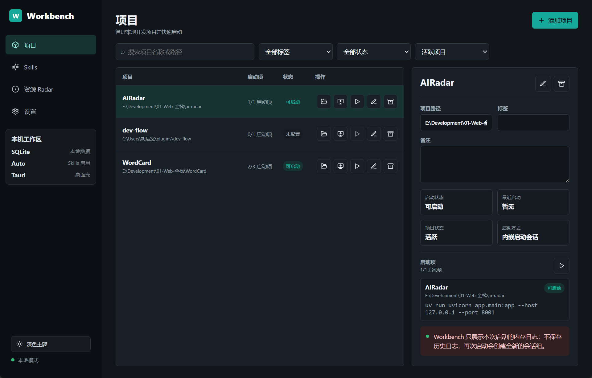
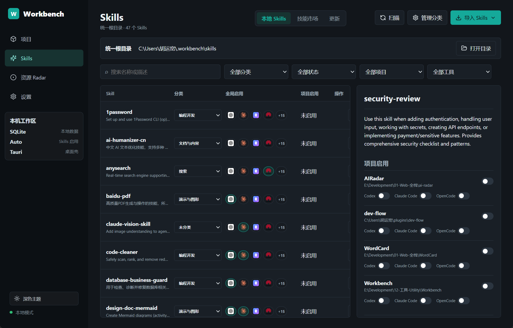

# Workbench App

Workbench App 是一个本地优先的 AI 开发工作台，用于集中管理本机开发项目、Skills、资源 Radar 和常用 Agent 工具入口。

它不是某个编辑器插件，也不是云端协作平台；它面向长期在本机维护多个项目、多个 Coding Agent 和多套 Skills 的个人开发者，目标是把分散在目录、终端、配置文件和浏览器收藏里的开发资产收拢到一个可见、可控、可恢复的桌面工作台。

## 产品预览

### 项目工作台

管理本地项目、启动配置和本次启动会话。项目启动日志保留在当前应用运行期间，适合快速查看开发服务是否正常启动。



### Skills 管理

以统一根目录保存 Skills 的唯一真实副本，并按工具、项目和分类管理启用状态。



## 核心能力

### 项目管理

- 添加和维护本地项目路径、标签、备注和归档状态。
- 为项目配置一个或多个启动项。
- 通过 Workbench 创建非交互式内嵌启动会话，并查看本次启动日志。
- 使用全局项目打开方式 Profiles，从项目列表快速打开 VS Code、PowerShell、Claude Code 等外部工具。
- 归档项目只影响 Workbench 本地记录，不移动、不删除项目目录。

### Skills 管理

- 使用统一 Skills 根目录保存唯一真实副本，默认路径为 `~/.workbench/skills`。
- 扫描、搜索、分类、导入和删除 Skills。
- 支持 ZIP 文件或已解压文件夹导入多个 Skills。
- 通过 skills.sh 技能市场浏览、安装、卸载和批量更新第三方 Skills，安装由 Workbench 下载到本地 Skills 根目录。
- 通过 Auto 同步为全局工具或指定项目启用 Skill：优先 Symlink，失败时回退 Copy。
- 扫描全局工具目录中的同名 Skill；内容一致时自动登记为 Workbench 管理，内容冲突时由用户选择唯一版本源解决。
- 支持 Codex、Claude Code、OpenCode、DevEco Code、Hermes、Kimi Code、Pi Agent、Gemini CLI、Qwen Code、Goose、Kilo Code、Cline、Roo Code、Factory Droid、Amp、Kiro CLI 和 Junie CLI 的全局 Skills 目录管理。
- 项目级 Skills 当前支持 Codex、Claude Code 和 OpenCode。

### 资源 Radar

- 本地维护项目、资讯、论文和其他开发资源。
- 支持搜索、筛选、收藏、编辑、删除和打开链接。
- 支持从当前 `gh` CLI 账号手动同步 GitHub Stars。
- GitHub Stars 同步不会覆盖用户维护的分类、领域、标签、备注和收藏状态。
- 多条手动资源匹配同一个 GitHub 仓库时进入待合并重复组，由用户选择主资源。

### 设置与应用行为

- 查看和打开 Workbench 本地数据目录、SQLite 数据库目录和 Skills 根目录。
- 管理支持工具的全局 Skills 目录。
- 调整 Skills 列表中的全局工具展示顺序。
- 打开不存在的工具目录时，可确认创建对应目录。
- 支持浅色和深色主题。
- 关闭主窗口默认隐藏到系统托盘并首次提示；设置页可切换为关闭窗口时退出应用。

## 数据边界

Workbench 是本地优先应用。当前数据默认保存在本机：

- SQLite 数据库：`~/.workbench/workbench.sqlite`
- Workbench Skills 根目录：`~/.workbench/skills`

重要边界：

- 不上传项目、Skills 或资源数据。
- 不覆盖、不合并用户已有的外部 Skills 目录内容。
- 停用 Skill 时只移除 Workbench 记录的符号链接或完整副本。
- 删除 Skill 不删除未被 Workbench 管理的工具目录内容。
- 项目启动日志只保存在当前应用运行期间，不作为历史日志持久化。

## 技术栈

- Tauri 2
- Rust
- React 18
- TypeScript
- Vite
- SQLite

## 本地开发

环境要求：

- Node.js
- pnpm
- Rust 与 Cargo
- Windows WebView2

安装依赖：

```bash
pnpm install
```

启动 Web UI：

```bash
pnpm dev
```

启动 Tauri 桌面应用：

```bash
pnpm tauri:dev
```

运行统一验证：

```bash
pnpm verify
```

验证 Tauri Release 构建：

```bash
pnpm tauri:verify-build
```

生成 Windows exe / 安装包：

```bash
pnpm tauri build
```

构建产物通常位于：

- `src-tauri/target/release/workbench-app.exe`
- `src-tauri/target/release/bundle/`

## 发布说明

应用更新基于 GitHub Releases 和 Tauri updater。发布带自动更新能力的版本时，必须生成安装包、签名文件和 `latest.json`。

签名密钥路径记录在 [AGENTS.md](AGENTS.md) 和 [应用更新能力文档](docs/capabilities/app-update.md)。不要把私钥或密码写入仓库，也不要在终端输出私钥内容。

## 项目结构

```text
Workbench/
├─ AGENTS.md
├─ CONTEXT.md
├─ docs/
│  ├─ ai/
│  ├─ assets/
│  ├─ capabilities/
│  ├─ plans/
│  ├─ ARCHITECTURE.md
│  └─ PRD.md
├─ src/
│  ├─ components/
│  ├─ contexts/
│  ├─ lib/
│  ├─ App.tsx
│  ├─ main.tsx
│  └─ styles.css
├─ src-tauri/
│  ├─ src/
│  ├─ Cargo.toml
│  └─ tauri.conf.json
├─ DESIGN.md
├─ design-tokens.json
└─ package.json
```

## 文档入口

- [产品需求文档](docs/PRD.md)
- [架构说明](docs/ARCHITECTURE.md)
- [设计系统](DESIGN.md)
- [项目上下文](CONTEXT.md)
- [文档索引](docs/ai/context-map.md)
- [变更记录](CHANGELOG.md)
